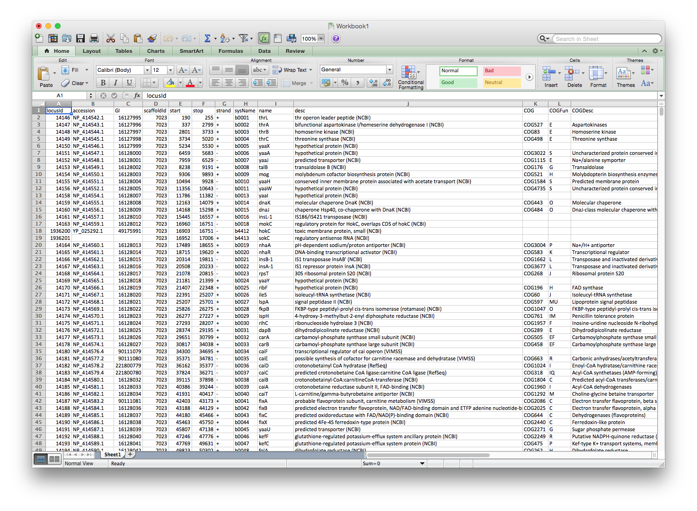
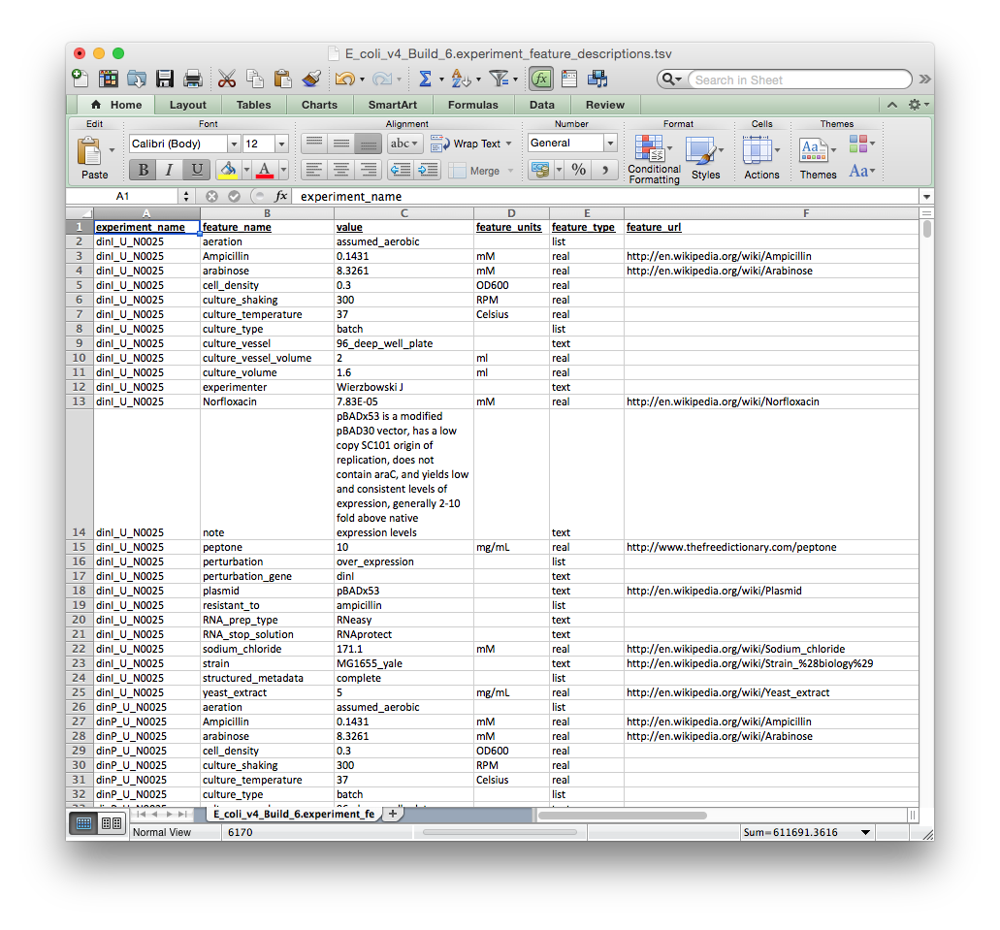

Assemble Tutorial
=================

**Important!!! This tutorial assumes you have access to a complete cMonkey2 ensemble.**

In a nutshell
-------------

The ASSEMBLE scripts transfer and compile individual cMonkey2 SQLite databases into an integrated MongoDB database.

In addition, they perform several post-processing steps, including: detection of gene regulatory elements (GREs) by comparing individual bicluster motifs with TOMTOM and clustering with MCL, genome-wide scanning of motifs with FIMO, and detection of co-regulated modules or **corems** using link-community detection.

Requirements
------------

  * MongoDB >= 2.4.9
  * compiled C++ scripts for corem detection, available here

IMPORTANT: This tutorial currently assumes that ``TOMTOM``, ``MCL`` and ``FIMO`` have already been run.

A single GRE definition file is read from, eg:

.. highlight:: none

::

   /ensemble-head-dir
       /out.mot_metaclustering.txt.I45.txt

FIMO scans are read from each run sub-directory, eg:

.. highlight:: none

::

   /ensemble-head-dir
       /org-out-xxx
           /fimo-outs
               /fimo-out-xxxx.bz2

Optional:

  * ``row_annot``: tab-delimited row (gene) annotations. Will be downloaded from MicrobesOnline automatically using ``--ncbi_code`` if undefined
  * ``col_annot``: tab-delimited column (condition) annotations.

The format for these files will be described in detail below.

Additionally, the Python modules described on the Home page are required to run these scripts.

Scripts
-------

  * ``egrin2-assemble``: The control function for ASSEMBLE scripts.
  * ``makeCorems.py``: Identifies corems using C++ scripts compiled above
  * ``resample_QSub.py``: Generates QSub script for submission of resamples to cluster
  * ``sql2mongoDB.py``: Merges individual cMonkey SQLite dbs and post-processing data into MongoDB

.. highlight:: none

::

   $ egrin2-assemble -h

    usage: egrin2-assemble [-h] --organism ORGANISM --ratios RATIOS
                           [--targetdir TARGETDIR] [--backbone_pval BACKBONE_PVAL]
                           [--cores CORES] [--link_comm_score LINK_COMM_SCORE]
                           [--link_comm_increment LINK_COMM_INCREMENT]
                           [--link_comm_density_score LINK_COMM_DENSITY_SCORE]
                           [--corem_size_threshold COREM_SIZE_THRESHOLD]
                           [--n_resamples N_RESAMPLES]
                           [--cluster_arch CLUSTER_ARCH] [--sge_user SGE_USER]
                           [--dbengine DBENGINE] [--host HOST] [--port PORT]
                           [--targetdb TARGETDB] [--prefix PREFIX]
                           [--ensembledir ENSEMBLEDIR] [--col_annot COL_ANNOT]
                           [--row_annot ROW_ANNOT]
                           [--row_annot_match_col ROW_ANNOT_MATCH_COL]
                           [--gre2motif GRE2MOTIF] [--genome_annot GENOME_ANNOT]
                           [result_dbs [result_dbs ...]]

    assemble.py - prepare cluster runs

    positional arguments:
      result_dbs

    optional arguments:
      -h, --help            show this help message and exit
      --organism ORGANISM   3 letter organism code
      --ratios RATIOS       Path to ratios file. Should be 'raw' (normalized)
                            ratios, not the standardized ratios used by cMonkey
      --targetdir TARGETDIR
                            Storage path for MongoDB and corem data
      --backbone_pval BACKBONE_PVAL
                            Significance pvalue for gene-gene backbone. Default =
                            0.05.
      --cores CORES         Number local cores to use for corem C++ scripts
      --link_comm_score LINK_COMM_SCORE
                            Scoring metric for link communities
      --link_comm_increment LINK_COMM_INCREMENT
                            Height increment for cutting agglomerative clustering
                            of link communities
      --link_comm_density_score LINK_COMM_DENSITY_SCORE
                            Density score for evaluating link communities
      --corem_size_threshold COREM_SIZE_THRESHOLD
                            Defines minimum corem size. Default = 3.
      --n_resamples N_RESAMPLES
                            Number resamples to compute for corem condition
                            assignment. Default = 10,000
      --cluster_arch CLUSTER_ARCH
                            where to run resampling on
      --sge_user SGE_USER   Cluster user name
      --dbengine DBENGINE   mongodb or sqlite
      --host HOST           MongoDB host. Default 'localhost'
      --port PORT           MongoDB port
      --targetdb TARGETDB   Optional ensemble MongoDB database name
      --prefix PREFIX       Ensemble run prefix. Default: *organism*-out-
      --ensembledir ENSEMBLEDIR
                            Path to ensemble runs. Default: cwd
      --col_annot COL_ANNOT
                            Tab-delimited file with experiment annotations
      --row_annot ROW_ANNOT
                            Optional row (gene) annotation tab-delimited file. If
                            not specified, annotations will be downloaded from
                            MicrobesOnline using --ncbi_code.
      --row_annot_match_col ROW_ANNOT_MATCH_COL
                            Name of column in row_annot that matches row names in
                            ratios file.
      --gre2motif GRE2MOTIF
                            Motif->GRE clustering file
      --genome_annot GENOME_ANNOT
                            Optional genome annotation file. Automatically
                            downloaded from MicrobesOnline using --ncbi_code

ASSEMBLE an EGRIN 2.0 ensemble
------------------------------

In this tutorial we will see how you would ASSEMBLE an *Escherichia coli* EGRIN 2.0 ensemble using several example files and a couple of cMonkey2 runs, which we provide here.

STEP 1: Generate optional input files
-------------------------------------

First, let's explore the optional annotation files. Providing annotations for genes and conditions is a great way to enrich your analysis of the ensemble. You can get a better idea for the utility of these metainformation by following the advanced mining tutorial

``row_annot``
~~~~~~~~~~~~~

As noted above, the ``row_annot`` file will be downloaded automatically from MicrobesOnline if a custom annotation is not provided. If you provide your own row_annot file, however, you will also need to specificy ``--row_annot_matchCol``, which is the name of the column in your annotation file that matches the gene name used by cMonkey2 (i.e. the row names in your ratios file).

The row annotation file should look like the annotation file supplied by MicrobesOnline, where each row specifies a gene and each of the columns specifies some information about that gene. Again, you must ensure that at least one of the columns contains gene names that match the gene names in the ratios file used by cMonkey2, in the case of MicrobesOnline, it is the ``sysName`` column.

Here is an example annotation fil e for *E. coli* direct from MicrobesOnline, the file itself is available here.

``col_annot``
~~~~~~~~~~~~~

The col_annot file provides metainformation about each experiment. Like the row_annot file, these annotations are optional, but they can be valuable for making sense of ensemble predicitions.

Please note that the file format is different here. Each row contains a particular experimental meta-annotation followed by several required descriptions: (1) experiment_name, (2) feature_name, (3) value, (4) feature_units, (5) feature_type. The experiment_name column should match the experiment name in the ratios file.

The `col_annot` file should look like the tab-delimited file depicted below. You can download an *E. coli* `col_annot` file to use as a template here

STEP 2: Run ``egrin2-assemble``
-------------------------------

**Important!!! TOMTOM, MCL, and FIMO should be run prior to assembly. Otherwise the ensemble will not contain GREs or motif scans.**

To run the assembler, you must supply several files. At a minimum, you should supply:

  * ``--organism``: 3 letter organism code
  * ``--ratios``: Path to ratios file. Should be 'raw' (normalized) ratios, not the standardized ratios used by cMonkey
  * ``--targetdir``: Storage path for MongoDB and corem data

*Note: The MongoDB engine has been replaced in favor of storing data in
sqlite because it does not require a running database server. Furthermore
the assembly step does not require a cluster anymore*

.. highlight:: none

::

  $ egrin2-assemble --organism mtu --ratios <ratios file> --targetdir <output directory> --targetdb <output database name>

This will run the entire assembly step
