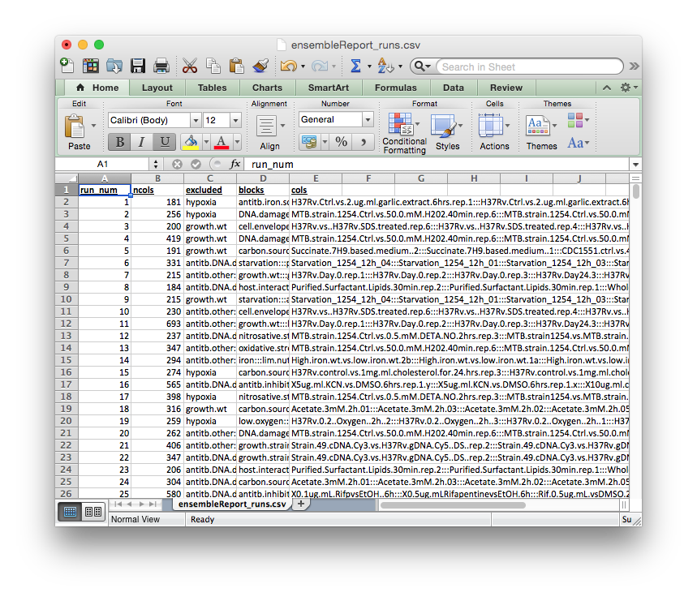
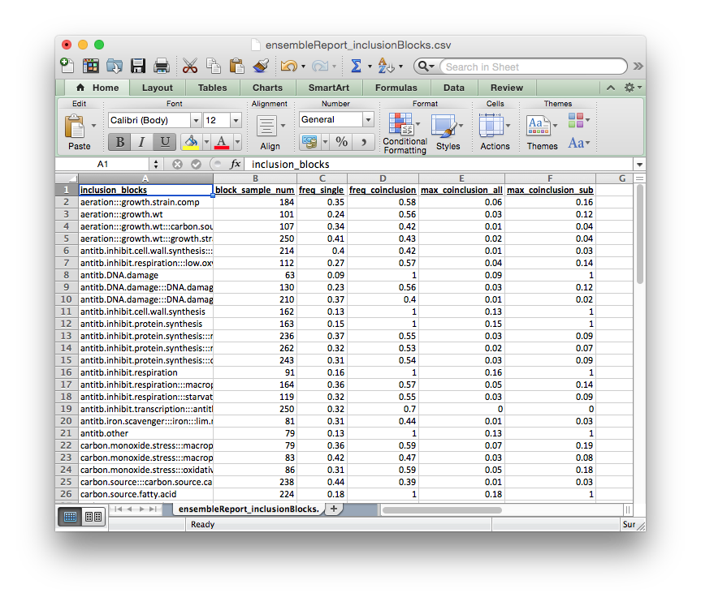
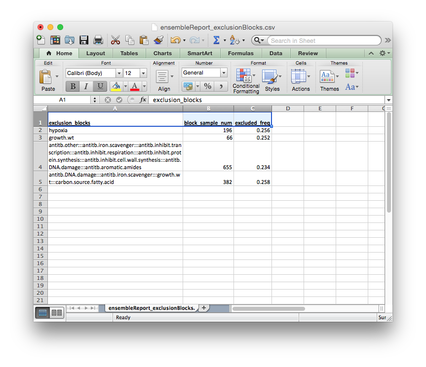

Build Tutorial
==============

In a nutshell
-------------

The BUILD scripts configure cMonkey2 to run on an SGE managed cluster. In the process, they change several cMonkey2 parameters to generate variability in each run. They also choose experiments to include in each run according to user-provided annotations.

Requirements
------------

User must supply several files, including:

  * ``ratios``: a Tab-delimited or Comma-separated file containing a matrix of gene expression values across all conditions.
  * ``blocks``: a Comma-separated file containing annotations for each condition.
  * ``inclusion_blocks``: a Comma-separated file containing groups of blocks to be co-included in runs.
  * ``exclusion_blocks``: a Comma-separated file containing groups of blocks to be co-excluded in runs.

Optionally:

  * ``pipeline``: a JSON file containing custom scoring pipeline. Currently only set-enrichment pipeline is supported
  * ``setenrich_files``: Comma-separated files containing set-enrichment sets. Multiple files should be separated by a comma.

The format for each of these files will be described in detail below.

We have provided example files for building an Mycobacterium Tuberculosis ensemble. The data come from the following publications:

`EJR Peterson, DJ Reiss, S Turkarslan, KJ Minch, T Rustad, CL Plaisier, WJR Longabaugh, DR Sherman, NS Baliga. (2014). A high-resolution network model for global gene regulation in Mycobacterium tuberculosis. Nucleic Acids Research <https://academic.oup.com/nar/article/42/18/11291/2434825/A-high-resolution-network-model-for-global-gene>`_.

`TR Rustad, KJ Minch, S Ma, JK Winkler, S Hobbes, MJ Hickey, W Brabant, S Turkarslan, ND Price, NS Baliga and DR Sherman. (2014). Mapping and manipulating the Mycobacterium tuberculosis transcriptome using a transcription factor overexpression-derived regulatory network. Genome Biology <https://genomebiology.biomedcentral.com/articles/10.1186/s13059-014-0502-3>`_

`KJ Minch, TR Rustad, EJR Peterson, J Winkler, DJ Reiss, S Ma, M Hickey, W Brabant, B Morrison, S Turkaslan, C Mawhinney, JE Galagan, ND Price, NS Baliga, DR. Sherman. (2014). The DNA-binding network of Mycobacterium tuberculosis. Nature Communications <https://www.nature.com/articles/ncomms6829>`_

Additionally, the Python modules described in this documentation's dependencies are required.

Scripts
-------

  * ``generate_cm2_runs.py``: The control function for BUILD scripts. Writes QSub script.
  * ``cMonkeyIniGen.py``: Templating function to generate cMonkey2 initialization (.ini) files.
  * ``ensemblePicker.py``: Picks experiments to include in a run given user-supplied experimental blocks

**BUILD** an EGRIN 2.0 ensemble
-------------------------------

In this tutorial we will **BUILD** an ensemble for Mycobacterium tuberculosis using several example files, which we provide here

STEP 1: Generate required input files
-------------------------------------

First, let's explore the required files.

``ratios.csv``
~~~~~~~~~~~~~~

A Tab-delimited or Comma-separated file containing a matrix of gene expression values across all conditions. Rows should correspond to genes and columns to individual conditions, as in the example file below.

.. figure:: _static/build/ratios.png
            :alt: Example ratios

``blocks.csv``
~~~~~~~~~~~~~~

A Tab-delimited or Comma-separated file containing the block membership for each experiment in the dataset as below.

``inclusion_blocks.csv``
~~~~~~~~~~~~~~~~~~~~~~~~

A Tab-delimited or Comma-separated file containing definitions for groups of blocks to be co-included in a cMonkey2 run, as defined above. These blocks are not **strictly** co-included in every cMonkey2 run, rather placement of a block into an inclusion block increases the likelihood that a particular block will be selected given that another block from its inclusion block has already been included in a particular cMonkey run.

Each group of blocks should be separated by ``:::``, as indicated in the template below. The names of each block should be the same as those defined in ``blocks.csv.gz`` above.

The ``block.sample.num`` column is not required, but can be useful for evaluating the blocks.

.. figure:: _static/build/inclusion_blocks.png
            :alt: Example inclusion_blocks

``exclusion_blocks.csv``
~~~~~~~~~~~~~~~~~~~~~~~~

A Tab-delimited or Comma-separated file containing definitions for groups of ``blocks`` to be co-excluded from a cMonkey2 run. Typically these blocks are defined for testing purposes. If they are not defined, several random ``exclusion blocks`` will be defined in order to evaluate model over-fitting (to be implemented)

The format for the ``exclusion blocks`` is the same as the ``inclusion blocks`` before. Each group of blocks should be separated by ``:::``, as indicated in the template below. The names of each block refer to those defined in ``blocks.csv.gz`` above.

Again, the ``block.sample.num`` column is not required.

.. figure:: _static/build/exclusion_blocks.png
            :alt: Example exclusion_blocks

Each of these files need to be supplied by the user.

(Optional) Generate custom scoring pipeline and files
-----------------------------------------------------

`cMonkey2 <https://github.com/baliga-lab/cmonkey2>`_ can use a custom scoring pipeline. Currently, this is limited to set-enrichment.

In this example, we will generate an ensemble. We do so by providing several additional options to the ``cMonkeyQSub.py`` function, namely:

  * ``pipeline``: a JSON file containing custom scoring pipeline. Currently only set-enrichment pipeline is supported
  * ``setenrich``: Name(s) of set enrichment 'sets' to include. Names should be comma separated.
  * ``setenrich_files``: Comma-separated files containing set-enrichment sets. Multiple files should be separated by a comma.

Users interested in building custom scoring pipelines or configuring set-enrichment should consult the cMonkey2 documentation.

STEP 2: Call generate_cm2_runs.py
---------------------------------

Generating an ensemble configuration entails calling a single Python script. There are a number of required and optional parameters that can be passed to this command line function, which are described below:

.. highlight:: none

::

   $ python generate_cm2_runs.py -h

   usage: generate_cm2_runs.py [-h] --organism ORGANISM --ratios RATIOS
                               --targetdir TARGETDIR [--numruns NUMRUNS]
                               [--ncbi_code NCBI_CODE] [--mincols MINCOLS]
                               [--num_cores NUM_CORES] [--max_tasks MAX_TASKS]
                               [--user USER] [--csh] [--blocks BLOCKS]
                               [--inclusion INCLUSION] [--exclusion EXCLUSION]
                               [--pipeline PIPELINE] [--setenrich SETENRICH]
                               [--setenrich_files SETENRICH_FILES]

   generate_cm2_params.py - prepare cluster runs for Sun Grid Engine

   optional arguments:
     -h, --help            show this help message and exit
     --organism ORGANISM   3 letter organism code
     --ratios RATIOS       Path to ratios file
     --targetdir TARGETDIR
                           Path to output directory
     --numruns NUMRUNS     Number of cMonkey2 runs to configure
     --ncbi_code NCBI_CODE
                           NCBI organism code
     --mincols MINCOLS     Minimum number of experiments to include in a cMonkey2
                           run
     --num_cores NUM_CORES
                           Number of cores on cluster to request
     --max_tasks MAX_TASKS
                           Maximum number of jobs to be sent to the cluster at a
                           time
     --user USER           Cluster user name
     --csh                 Flag to indicate C Shell
     --blocks BLOCKS       Path to block definitions
     --inclusion INCLUSION
                           Path to inclusion block definitions
     --exclusion EXCLUSION
                           Path to exclusion block definitions
     --pipeline PIPELINE   Path to scoring pipeline config file
     --setenrich SETENRICH
                           Name(s) of set enrichment 'sets' to include. Names
                           should be comma separated.
     --setenrich_files SETENRICH_FILES
                           Set enrichment files. File paths should be comma
                           separated.

Here we will concentrate on the required arguments.

Required Arguments
~~~~~~~~~~~~~~~~~~

  * ``organism``: 3-letter organism code
  * ``ratios``: ratios file described above
  * ``targetdir``: location of a directory in which to configure the cMonkey2 runs

If you do not supply block files as described above, the experiments to include in each run will be choosen randomly. Several random exclusion_blocks will be defined for testing (currently not supported - block files must be supplied / ANB 03042015)

Here we will assume that the required files are in the local working directory. Furthermore, we will assume that the ``generate_cm2_runs.py`` is in the working directory and that all of the required modules are in your ``$PYTHONPATH``.

For the following example, we will generate 5 cMonkey2 runs.

On the command line this would be called as follows:

.. highlight:: none

::

   $ python generate_cm2_runs.py --organism mtu --ratios ratios.csv --targetdir mtu-ens-2014 --numruns 10 --blocks blocks.csv --inclusion inclusion_blocks.csv --exclusion exclusion_blocks.csv --pipeline setenrich_pipeline.json --setenrich chipseq,tfoe --setenrich_files ChIPSeq.csv,DE.csv --csh

Optionally you can run this within the iPython, assuming this iPython notebook is running within the egrin2-tools Git repository.

.. highlight:: none

::

   %run ..//generate_cm2_runs.py --organism mtu --ratios ./static/example_files/ratios.csv --targetdir mtu-ens-2014 --numruns 5 --blocks ./static/example_files/blocks.csv --inclusion ./static/example_files/inclusion_blocks.csv --exclusion ./static/example_files/exclusion_blocks.csv --pipeline ./static/example_files/setenrich_pipeline.json --setenrich chipseq,tfoe --setenrich_files ./static/example_files/ChIPSeq.csv,./static/example_files/DE.csv --csh

   Choosing ensemble conditions
   Writing reports
   Writing ratio files
   Done
   Writing ensemble config files
   Done

If the scripts run successfully, they should print the messages above, populate the ``mtu-ens-2014`` directory with ``ratios-xxx.tsv`` files and ``config-xxx.ini`` files, as well as generate several report files in the parent directory. The ensemble report files contain information about the run composition, detailed for each report file below:

STEP 3: Evaluate ensembleReport files
-------------------------------------

``ensembleReport_runs.csv``

Global report of the ensemble run compositions.

The columns of this report file signify:

  * ``run_num``: cMonkey run number
  * ``ncols``: number of experiments included in the run
  * ``excluded``: ``exclusion block`` that was excluded from the run (i.e., none of the conditions in this block will be in the run)
  * ``blocks``: blocks that were included in the run
  * ``cols``: names of experiments (from column names of ``ratios.csv``) that were included in the run

``ensembleReport_cols.csv``
~~~~~~~~~~~~~~~~~~~~~~~~~~~

Extends ``blocks.csv``. Reports how often each condition was included in the ensemble.

.. figure:: _static/build/ensembleReport_cols.png
            :alt: Example ensemble report cols

The columns of this report file signify:

  * ``sample``: experiment name, from ``blocks.csv``
  * ``block``: ``block`` to which experiment belongs, from ``blocks.csv``
  * ``ensemble_freq``: rate of inclusion in the ensemble

``ensembleReport_blocks.csv``
~~~~~~~~~~~~~~~~~~~~~~~~~~~~~

Reports how often each block was included in the ensemble.

The columns of this report file signify:

  * ``block``: block name
  * ``block_sample_num``: number of experiments annotated by this block
  * ``ensemble_freq``: rate of inclusion in the ensemble

``ensembleReport_inclusionBlocks.csv``
~~~~~~~~~~~~~~~~~~~~~~~~~~~~~~~~~~~~~~

Reports how often each inclusion block was included in the ensemble.

The columns of this report file signify:

  * ``inclusion_blocks``: inclusion_block name. blocks separated by ``:::``
  * ``block_sample_num``: number of experiments included in this inclusion block
  * ``freq_single``: rate at which a single block from this inclusion_block is included in the ensemble
  * ``freq_coinclusion``: rate at which at least 2 of blocks from this inclusion_block are co-included in a single run
  * ``max_coinclusion_all``: rate at which **ALL** of blocks from this inclusion_block are co-included in a single run across all ensemble runs
  * ``max_coinclusion_sub``: rate at which **ALL** of blocks from this inclusion_block are co-included in a single run across all ensemble runs in which at least one of the blocks occurs

``ensembleReport_exclusionBlocks.csv``
~~~~~~~~~~~~~~~~~~~~~~~~~~~~~~~~~~~~~~

Reports how often each exclusion block was excluded in the ensemble.

The columns of this report file signify:

  * ``exclusion_blocks``: exclusion block name
  * ``block_sample_num``: number of experiments annotated by this exclusion block
  * ``excluded_freq``: rate of exclusion in the ensemble

STEP 4: Transfer to cluster and run cMonkey2
--------------------------------------------

The entire targetdir (e.g. ``mtu-ens-2014`` in our example) is now ready to be transfered to the cluster, where you can generate the ensemble by running ``org.sh``, where ``org`` is the 3-letter organism code you provided.
